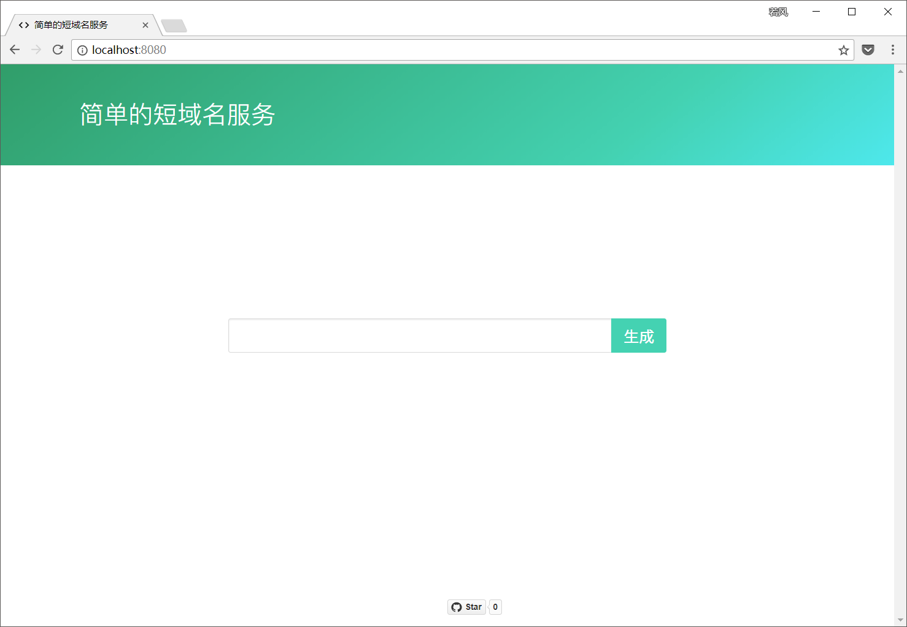
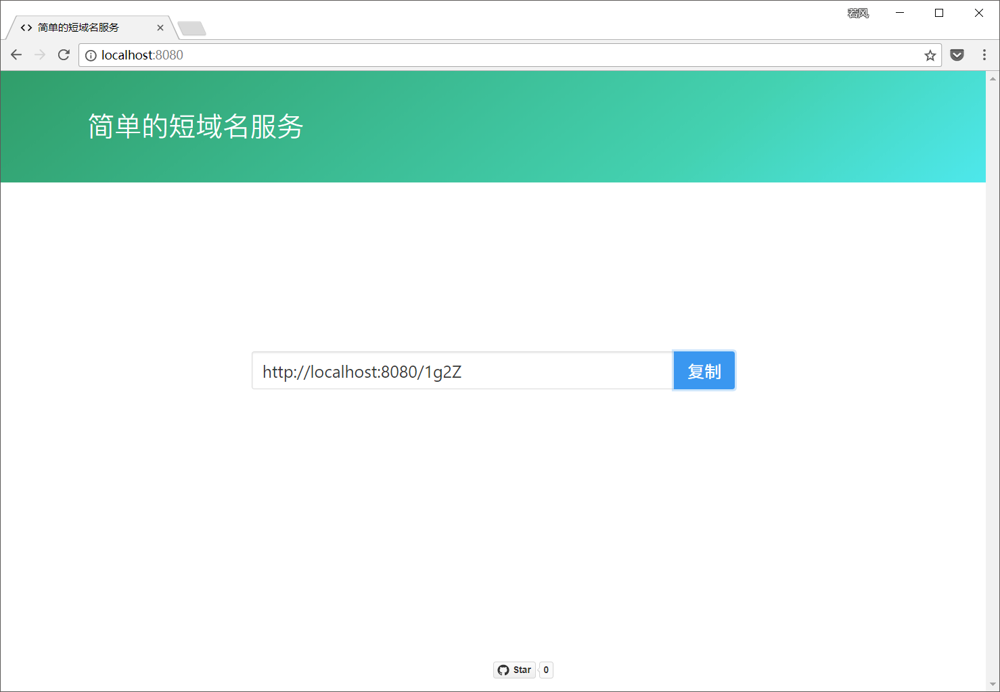

# URL Shortener 简单短链接实现

使用 Slim Framework 与 Laravel Eloquent ORM 实现。使用[hashids](https://github.com/ivanakimov/hashids.)来生成 6 位的唯一短域名，其中 salt 在 settings.php 中可指定。缓存使用了Memcached。

输入域名必须带有协议名，支持`(http|ftp)s`

## 使用

**导入数据库表**

```sql
CREATE TABLE `url` (
	`key` INT(10) UNSIGNED NOT NULL AUTO_INCREMENT,
	`url_short` VARCHAR(6) NOT NULL DEFAULT '0' COLLATE 'utf8_bin',
	`url_full` TEXT NULL COLLATE 'utf8_bin',
	`click` INT(10) UNSIGNED NOT NULL DEFAULT '0',
	`created_at` TIMESTAMP NOT NULL DEFAULT CURRENT_TIMESTAMP,
	PRIMARY KEY (`key`),
	UNIQUE INDEX `url_short` (`url_short`)
)
COLLATE='utf8_bin'
ENGINE=InnoDB
;
```

**运行项目**

```shell
$ composer install
$ composer start
> php -S localhost:8080 -t public public/index.php
```

## 预览




